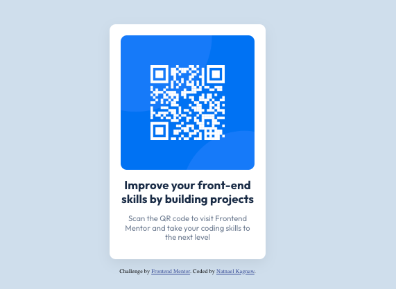

# Frontend Mentor - QR code component solution

This is a solution to the [QR code component challenge on Frontend Mentor](https://www.frontendmentor.io/challenges/qr-code-component-iux_sIO_H).

## Table of contents

- [Overview](#overview)
  - [Screenshot](#screenshot)
  - [Links](#links)
- [My process](#my-process)
  - [Built with](#built-with)
  - [What I learned](#what-i-learned)
  - [Continued development](#continued-development)
  - [Useful resources](#useful-resources)
- [Author](#author)
- [Acknowledgments](#acknowledgments)

## Overview

### Screenshot



### Links

- Solution URL: [Github Link](https://github.com/NatnaelSisay/qr-code-component-main)
- Live Site URL: [Netlify Link](https://fastidious-brioche-3aa34f.netlify.app/)

## My process

### Built with

- Semantic HTML5 markup
- CSS custom properties
- Flexbox
- CSS Grid
- Mobile-first workflow

### What I learned

I learned how to vertially align items in grid layout.

```css
.card {
	display: grid;
	justify-items: center; /* Horizontaly center*/
	align-content: start; /* Don't steach when height of card increase*/
}
```

### Continued development

I think i understood grid but it is not battle tested enough an i belive i should work on more complex layout using grid.

### Useful resources

- [CSS Scan](https://getcssscan.com/css-box-shadow-examples) - This helped me for setting up box shadow with just a click.
- [Josh Comeau](https://www.joshwcomeau.com/css/custom-css-reset/) - The perfect place for CSS Rest.

## Author

- LinkedIn - [Natnael Kagnaw](https://www.linkedin.com/in/natnael-kagnaw/)
- Frontend Mentor - [@NatnaelSisay](https://www.frontendmentor.io/profile/NatnaelSisay)

## Acknowledgments

I want to thank Frontend Mentor for this design and resource.
